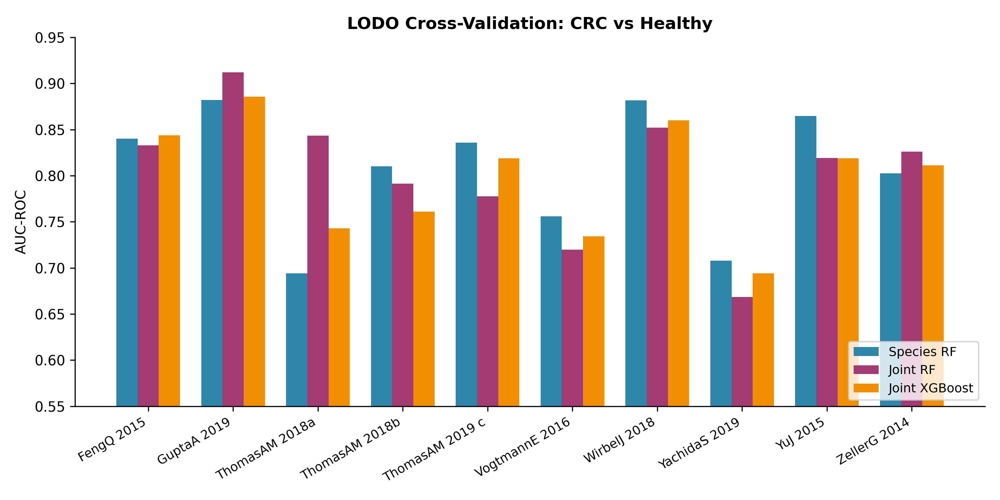
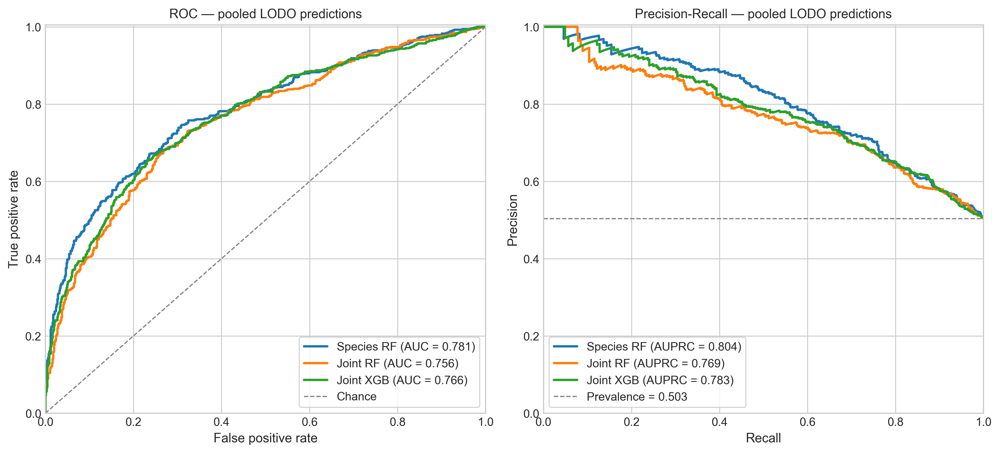
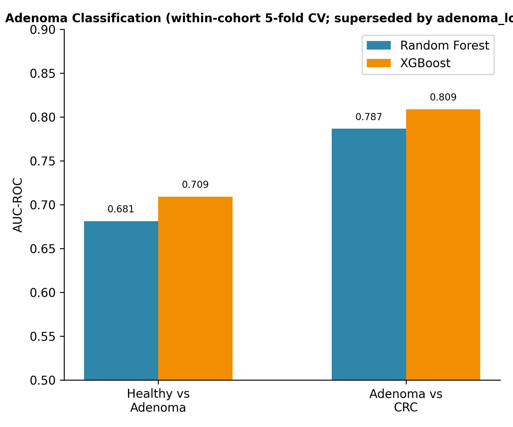
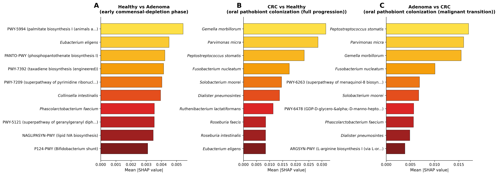

# Species-level taxonomic features alone outperform joint species-plus-pathway models for cross-cohort CRC classification

**Alejandro Velazquez¹, Rachel Selbrede²**

¹[FILL affiliation], ²[FILL affiliation]
[FILL conference name and date]
Code & data: github.com/alejandro-publius/crc-metagenomics

---

## Motivation

- Shotgun gut metagenomics can discriminate CRC from controls; prior meta-analyses report AUC ~0.80.
- Open question: do HUMAnN **functional pathway** features add signal beyond MetaPhlAn **species** profiles?
- Open question: how robust are these classifiers to cohort composition, batch effects, and population structure?
- We re-evaluate the Thomas et al. (2019) framework with a stricter design: 10 cohorts, country-aware LODO, formal DeLong comparison, systematic robustness battery.

---

## Dataset: 10 cohorts, 8 countries, 1,522 samples

| Cohort           | Country | N     | CRC | Adenoma | Control |
|------------------|---------|-------|-----|---------|---------|
| FengQ_2015       | AUT     | 154   | 46  | 47      | 61      |
| GuptaA_2019      | IND     | 60    | 30  | 0       | 30      |
| ThomasAM_2018a   | ITA     | 80    | 29  | 27      | 24      |
| ThomasAM_2018b   | ITA     | 60    | 32  | 0       | 28      |
| ThomasAM_2019_c  | JPN     | 80    | 40  | 0       | 40      |
| VogtmannE_2016   | USA     | 104   | 52  | 0       | 52      |
| WirbelJ_2018     | DEU     | 125   | 60  | 0       | 65      |
| YachidaS_2019    | JPN     | 575   | 258 | 67      | 250     |
| YuJ_2015         | CHN     | 128   | 74  | 0       | 54      |
| ZellerG_2014     | FRA     | 156   | 53  | 42      | 61      |
| **TOTAL**        | —       | **1,522** | **674** | **183** | **665** |

HanniganGD_2017 excluded a priori for low sequencing depth.

---

## Methods I — features and classifiers

- **Species:** 229 MetaPhlAn features after 10% prevalence and mean >= 1e-4 filter; log10(x + 1e-6) transform.
- **Pathways:** 551 candidate HUMAnN unstratified pathways; **re-filtered per fold** (prev >= 10%, mean >= 1e-6) on training cohorts only -> 402-406 features per fold (prevents leakage).
- **Classifiers:** species-only RF (500 trees, `max_features='sqrt'`, `min_samples_leaf=5`, `class_weight='balanced'`); joint species+pathway RF; joint species+pathway XGBoost.
- **Inference:** DeLong test on pooled held-out predictions; per-cohort paired t / Wilcoxon; 10,000-resample cohort-stratified bootstrap CIs.

---

## Methods II — country-aware LODO

- Naive LODO: train on N-1 cohorts, test on the held-out cohort.
- **Population-level confounder:** two Italian cohorts (ThomasAM_2018a, _2018b) and two Japanese cohorts (ThomasAM_2019_c, YachidaS_2019).
- Country-aware fix: when a cohort is the test fold, also drop all cohorts sharing its country.
- **Why it matters:** naive LODO inflates ThomasAM_2019_c to AUC **0.998**; country-aware AUC is **0.836** — a 0.16 AUC drop attributable to population structure alone.

---

## Headline result — species-only RF

- Per-cohort mean LODO AUC **0.807 ± 0.065** across 10 folds.
- Pooled AUC **0.781** (95% CI 0.757–0.805; n = 1,339; 10,000-resample cohort-stratified bootstrap).
- Best fold: GuptaA_2019 and WirbelJ_2018 (both 0.882, no country exclusion).
- Worst fold: ThomasAM_2018a (0.694, n_test = 53, country-paired exclusion).
- Consistent with Thomas et al. 2019 (~0.80 across 5 cohorts) on a harder 10-cohort design.

---

## Negative result — pathways do NOT help

- Joint RF pooled AUC **0.756** (0.731–0.781) vs species-only **0.781**.
- Joint XGBoost pooled AUC **0.766** (0.740–0.791) vs species-only **0.781**.
- **DeLong, pooled, n = 1,339:**
  - species_rf vs joint_rf: z = **3.35**, p = **0.0008**
  - species_rf vs joint_xgb: z = 2.00, p = 0.046
- Per-cohort paired tests (n=10) are non-significant (t-test p = 0.87, 0.28) — under-powered at fold level.
- Signal driven by the largest fold (YachidaS_2019, n_test = 508): species 0.708 vs joint RF 0.669, joint XGB 0.694.

---

## Why pathways don't help

- **Dimensionality:** joining ~400 pathways to 229 species nearly triples feature count. Under RF `max_features='sqrt'` and XGB `colsample_bytree=0.8`, informative-species sampling probability falls.
- **Redundancy:** unstratified pathway abundance is collinear with the species that encode the genes. The four oral pathobionts dominating species SHAP already drive most pathway signal.
- Biologically-guided 84-pathway shortlist mean LODO AUC **0.817** — matches but does not beat the 0.807 species baseline.
- Consistent with high-dim / low-sample literature (Bellman 1961; Trunk 1979) at n ~ 1,300.
- Not a categorical claim — Piccinno et al. 2025 (~3,700 metagenomes) reach AUC ~0.85; calculus may shift at scale.

---

## Adenoma progression — stepwise model

- LODO across 4 adenoma-containing cohorts (FengQ_2015, ZellerG_2014, ThomasAM_2018a, YachidaS_2019; n_adenoma = 183).
- **Healthy vs Adenoma:** RF 0.561, XGB 0.579 — near chance.
- **Adenoma vs CRC:** RF 0.671, XGB 0.617 — moderate.
- Stepwise interpretation: early adenoma microbiome ≈ control by global stool composition; oral-pathobiont enrichment colonises at / near malignant transformation.
- Clinical reading: stool metagenomics unlikely to detect early adenoma at useful sensitivity; potentially valuable for distinguishing advanced lesions from carcinoma and for post-resection monitoring.

---

## SHAP — the four oral pathobionts

- Top species (RF mean |SHAP|, CRC vs control):
  1. *Gemella morbillorum* (0.032)
  2. *Parvimonas micra* (0.029)
  3. *Peptostreptococcus stomatis* (0.023)
  4. *Fusobacterium nucleatum* (0.018)
  5. *Solobacterium moorei* (0.015)
- Same signature dominates **adenoma-vs-CRC** SHAP, weak in **H-vs-A** — supports stepwise model.
- Reproducible across RF and XGBoost despite different splitting criteria, across cohorts on three continents.
- *F. nucleatum* mechanism: FadA-mediated E-cadherin / beta-catenin signalling; tumour-permissive immune modulation.

---

## Sensitivity analyses — the headline is robust

- **Random seeds** (5 seeds {0,1,2,42,100}): per-cohort AUC **0.810 ± 0.002**.
- **Pathway filter grid** (4 prevalence × 5 mean = 20 cells): per-cohort AUC **0.794–0.812**, spread 0.018.
- **Demographic adjustment** (age, sex, BMI; direct + residualized × RF + XGB): per-cohort AUC **0.800–0.814** vs 0.807 unadjusted.
- **ComBat batch correction** (per-fold, fit on training cohorts): per-cohort AUC **0.815**.
- **External validation** (train on 8, test on YuJ_2015 + ZellerG_2014 pooled): AUC **0.833** (combined).
- Headline does not move under any single perturbation.

---

## Limitations

- Metadata harmonisation limited to age, sex, BMI; no adenoma stage, tumour location, TNM, treatment history in curatedMetagenomicData.
- Cross-sectional only — no longitudinal samples for progression / post-treatment.
- All cohorts pre-processed through the curatedMetagenomicData uniform pipeline; non-curatedMetagenomicData cohorts not tested.
- No nested-CV tuning (joint model fails to beat species at defaults; tuned joint models could narrow the gap).
- Pathway features are unstratified; taxon-stratified pathways excluded due to redundancy.
- Adenoma analyses underpowered (4 cohorts, n = 183) — hypothesis-generating.

---

## Conclusions

1. Species-only RF is the right default for cross-cohort CRC classification at current sample sizes (pooled LODO AUC **0.781 [0.757, 0.805]**, n = 1,339).
2. Adding HUMAnN unstratified pathways **significantly degrades** pooled performance (DeLong z = 3.35, p = 0.0008).
3. **Country-aware LODO** is essential; naive LODO inflates ThomasAM_2019_c from 0.836 to 0.998.
4. Four **oral pathobionts** (*F. nucleatum*, *P. stomatis*, *P. micra*, *G. morbillorum*) drive the signal and emerge near malignant transformation, not at the adenoma stage.

---

## Acknowledgments + code

- curatedMetagenomicData team and the authors of the 10 contributing cohorts.
- Computation: [FILL: HPC / lab acknowledgment].
- Funding: [FILL: confirm — currently no external funding to declare].
- **All code, processed data, per-sample predictions, and decision logs:**
  github.com/alejandro-publius/crc-metagenomics
- Contact: [FILL: corresponding email].

Thank you. Questions?
