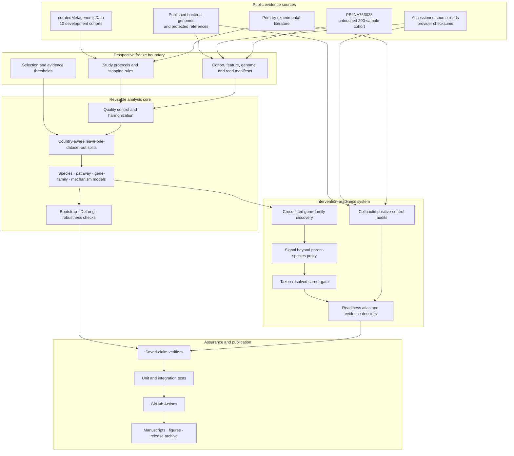
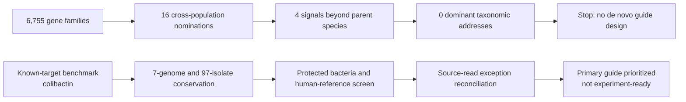

# Research system architecture

The repository is organized as a reproducible evidence system, not as a single
machine-learning model. Its job is to keep four things separate:

1. discovering a cross-study signal;
2. estimating whether that signal transfers to a new population;
3. deciding whether it identifies a credible microbial intervention address;
4. distinguishing computational evidence from laboratory validation.

## End-to-end data flow

## The candidate state machine

Every de novo intervention candidate moves through the same ordered gates. A
failure stops downstream guide design; it does not erase the candidate.

The upper discovery track produces the paper's main methodological result: a
database label is not proof that a sequence belongs mainly to one bacterium.
The lower benchmark track demonstrates what later evidence gates look like
without reviving a failed de novo candidate.

## Component map

| Layer | Main paths | Responsibility |
|---|---|---|
| Evidence freeze | `research/intervention_readiness/`, `results/*/manifest*` | Record populations, targets, thresholds, checksums, and stopping rules before results are interpreted |
| Data preparation | `scripts/export_*.R`, `scripts/preprocessing.py`, `data/processed/` | Export public profiles, harmonize sample identifiers, apply quality rules, and produce model inputs |
| Modeling core | `src/crc_lodo_bench/`, `scripts/train_*.py` | Construct country-aware held-out splits and fit leakage-safe reference models |
| Portability analysis | `results/generalization_risk/`, `results/external_cohort/` | Compare representations, estimate transfer risk, and retain the untouched external result |
| Intervention discovery | `src/crc_lodo_bench/discovery.py`, `scripts/parent_species_adjustment.py`, `scripts/analyze_candidate_taxa.py` | Move gene families through recurrence, parent-independence, and carrier-resolution gates |
| Positive control | `scripts/audit_*colibactin*.py`, `scripts/resolve_colibactin_guide_exceptions.py` | Audit published guides against frozen genomes, protected references, and source reads |
| Evidence products | `results/intervention_readiness/readiness_atlas.csv`, `results/intervention_readiness/dossiers/` | Preserve every pass, rejection, unresolved status, and claim boundary |
| Assurance | `scripts/verify_results.py`, `scripts/verify_intervention_readiness.py`, `tests/`, `.github/workflows/verify.yml` | Recompute headline assertions and fail CI when committed evidence disagrees |
| Publication | `manuscript/`, `figures/`, `release/` | Package the verified results for coauthor review, journal submission, and archival release |

## Trust boundaries

### Held-out populations cannot select themselves

Feature filtering, scaling, and supervised selection occur inside the training
side of each country-aware split. Cohorts from the same country are held out
together. The external cohort is scored only after its manifest and model path
are frozen.

### Association cannot substitute for addressability

A gene family may predict CRC while being distributed across many bacterial
species. The taxon-resolved carrier gate therefore runs before conservation,
specificity, delivery, or laboratory planning. The current run stops all four
de novo survivors at this boundary.

### Computational evidence cannot become a treatment claim

Genome matches, near-match screens, AlphaFold predictions, and source-read
reconciliation cannot establish expression, knockdown, delivery, biological
specificity, or safety. Those claims require a prespecified laboratory study
and direct biological review.

### Failures are first-class outputs

Rejected and unresolved candidates remain in the atlas, dossiers, audit JSON,
and manuscript. This prevents a later rerun from quietly presenting a different
shortlist without explaining where the earlier candidates went.

## Execution surfaces

- `REPRODUCING.md` is the complete command-by-command research rebuild guide.
- `workflow/Snakefile` is the compact dependency graph for the research catalog,
  sanity checks, selected audits, verification, and fast tests.
- `.github/workflows/verify.yml` is the fast remote merge gate over committed
  results and manuscript claims.
- `results/decisions_addendum.md` records analytical decisions and alternatives.

Large provider data are regenerated locally and ignored by Git. Small manifests,
checksums, derived summaries, and verification artifacts are committed so a
reviewer can trace every headline claim without downloading the full raw-data
collection.

## Visual index

- [`figures/visual_abstract.png`](../figures/visual_abstract.png): cohorts,
  country-aware validation, model comparison, and adenoma-to-CRC signal.
- [`PortabilityLandscape.png`](../manuscript/generalization_risk/figures/PortabilityLandscape.png):
  portability across increasingly detailed biological representations.
- [`GeneralizationRisk.png`](../manuscript/generalization_risk/figures/GeneralizationRisk.png):
  historical versus label-free target-performance estimates.
- [`Figure1_target_attrition.png`](../manuscript/intervention_readiness/figures/Figure1_target_attrition.png):
  the 6,755 → 16 → 4 → 0 intervention-readiness funnel.
- [`Figure2_colibactin_guide_tradeoff.png`](../manuscript/intervention_readiness/figures/Figure2_colibactin_guide_tradeoff.png):
  the opposing conservation and specificity rankings of two published guides.
